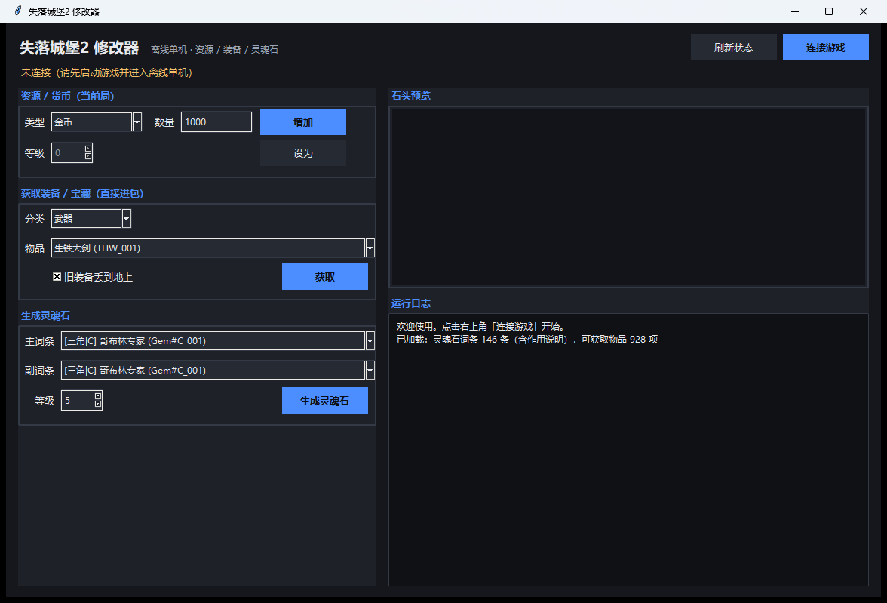

# 失落城堡2修改器

一个图形界面的修改器，支持资源修改、指定物品获取与灵魂石生成。
**仅限离线单机个人使用，请勿用于联机或商业用途。**



---

## ✨ 功能特性

| 模块 | 说明 |
|---|---|
| 资源 / 货币 | 金币、魂晶碎片、魔铁锭、黑铁原石、魂花：可「增加」或「设为」指定数值 |
| 获取装备 / 宝藏 | 928 项物品（武器 / 防具 / 被动宝藏 / 主动道具 / 消耗品），按中文名选择，直接进包或替换当前装备 |
| 旧装备落地 | 可勾选：换武器 / 防具时把旧装备丢到地上 |
| 生成灵魂石 | 146 条词条，支持双词条、主副同词条、单词条（六角 / 普通均可），生成后自动写入存档 |
| 运行日志 | 成功 / 完成绿色，错误 / 拒绝红色，实时显示数值前后变化 |
| 边界保护 | 背包重量上限、宝藏重复获取、堆叠上限等均由游戏规则判定，超限会自动拒绝 |

---

## 🚀 快速开始

### 方式一：直接使用打包版（推荐，无需 Python）

1. 到本仓库的 **Releases** 页面下载 `失落城堡2修改器.exe`
2. 启动游戏并进入 **离线单机**
3. 双击该 exe，点击 **连接游戏** 即可使用

> 体积约 **42 MB**（内置 Python 运行环境与 frida，无需安装任何依赖）。
> 单文件 exe 首次启动会解压到临时目录，约需 3–5 秒；之后启动更快。

### 方式二：从源码运行

**前置要求**

- Windows 10 / 11（64 位）
- **Python 3.9 及以上**（3.7+ 亦可，推荐 3.9 ~ 3.12；安装时勾选 **Add Python to PATH**）
- 首次运行需要联网（自动安装依赖 `frida==16.7.19`）

**步骤**

1. 下载 / 克隆本仓库到本地
2. **双击 `start.bat`**（首次会自动创建 `venv` 并安装依赖，约 1–2 分钟）
3. 启动游戏并进入 **离线单机**
4. 在窗口中点击 **连接游戏**

**如果自动安装失败（手动方式）**

```powershell
python -m venv venv
.\venv\Scripts\python.exe -m pip install -r requirements.txt
.\venv\Scripts\pythonw.exe LC2TrainerGUI.py
```

`requirements.txt`：

```
frida==16.7.19
```

---

## 🎮 使用说明

| 面板 | 何时可用 | 操作 |
|---|---|---|
| 资源 / 货币 | 局内（战斗中） | 选类型 → 填数量 → 点「增加」或「设为」；魂花需要选择等级 |
| 获取装备 / 宝藏 | 局内 | 选分类 → 选物品 → 勾选是否丢弃旧装备 → 点「获取」 |
| 生成灵魂石 | **营地 → 灵魂刻印界面** | 选主词条 / 副词条 / 等级 → 点「生成灵魂石」；副词条选「【无】仅主词条」即为单词条石头 |

日志示例：

```
[完成] res => {'code': 5, 'before': 6614, 'after': 7614, ...}
[成功] 已获取：THW_001（旧装备丢弃=True，校验=0）
[拒绝] PassiveProps_GiantKiller → 已拥有该宝藏（不能重复入包）
```

---

## 📁 文件说明

```
LC2修改器/
├── start.bat      # 双击启动
├── LC2TrainerGUI.py    # 图形界面
├── agent.js            # 修改逻辑（游戏运行时注入）
├── gem_affix.json      # 灵魂石词条数据（146 条）
├── items_give.json     # 可获取物品数据（928 项）
├── requirements.txt
├── screenshot.png      # 界面截图
└── venv/               # 自包含 Python 环境（可选，不随仓库提交）
```

---

## ⚠️ 注意事项

- **仅限离线单机**：请勿在联机模式使用。
- **建议先备份存档**（Steam 云存档目录 `Steam\userdata\<steamid>\2445690\remote`）。
- 若连接失败：确认游戏已启动且为离线单机；若上次异常退出，请重启游戏后再连接。
- 灵魂石功能需先进入营地并打开「灵魂刻印」界面，词条数据才会加载。
- 局内资源会在结算 / 回营地时由游戏保存。
- 游戏更新后部分功能可能失效，需要更新后重新适配。

---

## ❓ 常见问题

**Q：点“连接游戏”没反应 / 失败？**
先确认游戏在运行且已进入离线单机；若之前注入异常退出，重启游戏即可。

**Q：提示“item data not found”？**
说明该物品 ID 命名与常见分类不同，可在日志中查看具体 ID，或在 `items_give.json` 中核对。

**Q：灵魂石界面生成失败？**
通常是还没打开营地「灵魂刻印」界面，或主 / 副词条组合不被游戏接受。

**Q：改了金币但重启后没变？**
局内数值会在结算或回到营地时写入存档，请走一次正常结算流程。

---

## 🧭 版本信息

| 项目 | 值 |
|---|---|
| 游戏 | 失落城堡2（Steam AppID 2445690） |
| 验证日期 | 2026-09 |

---

## 📜 免责声明

- 本项目仅供**学习交流**与**离线单机个人使用**，请勿用于联机对局、商业用途或二次分发盈利。
- 不包含任何游戏本体资源；游戏名称、角色、物品名称等版权归 **Hunter Studio** 及相应权利人所有。
- 使用本工具产生的一切后果由使用者自行承担。